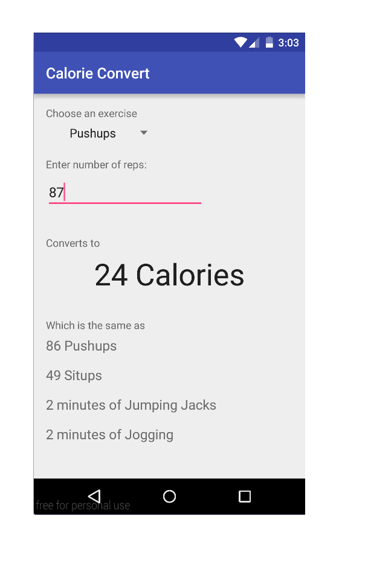
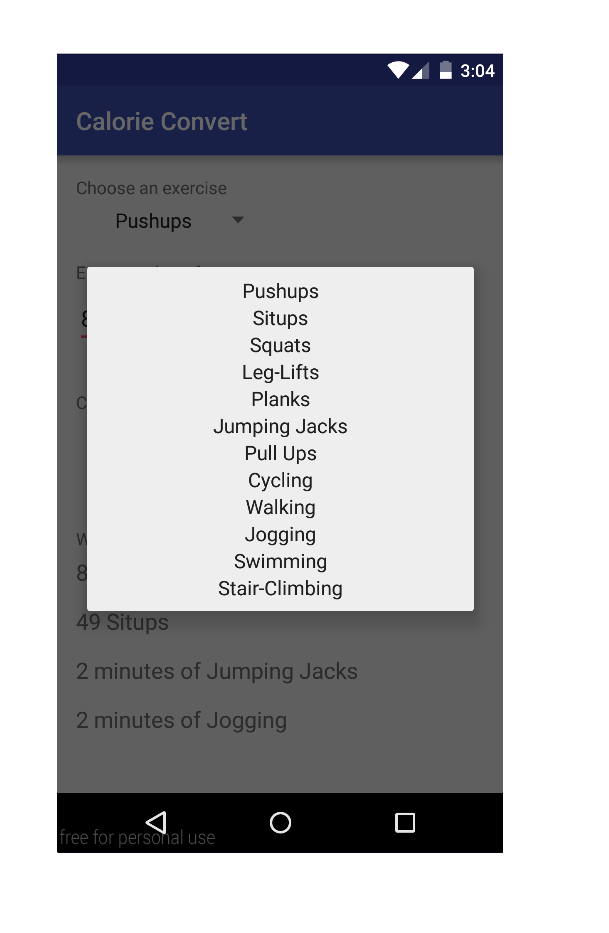

# PROG 01: Crunch Time

This app allows you to find the amount of calories you've burned for a given exercise and the amount of time/reps done. It also allows you to see the equivalent amount of work you did for that exercise in terms of number of reps of Pushups and Situps and minutes of Jumping Jacks and Jogging.

The first image below shows the main screen, the second shows the list of exercises to select from when the spinner is tapped.

The calorie conversions are based on data for people of 150 lbs.

## Author

Andre Askarinam ([andreaskari@berkeley.edu](mailto:andreaskari@berkeley.edu))

## Demo Video

See [Introduction to Calorie Convert] (https://youtu.be/FPvyhvN5tVY)

## Screenshots

## Acknowledgments

* Thank you to slidenerd on Youtube for the excellent tutorial on Android spinner: https://www.youtube.com/watch?v=aApS2W-j8oM
* I'd like to thank my parents for granting me the help necessary throughout my life in order to be at UC Berkeley.
